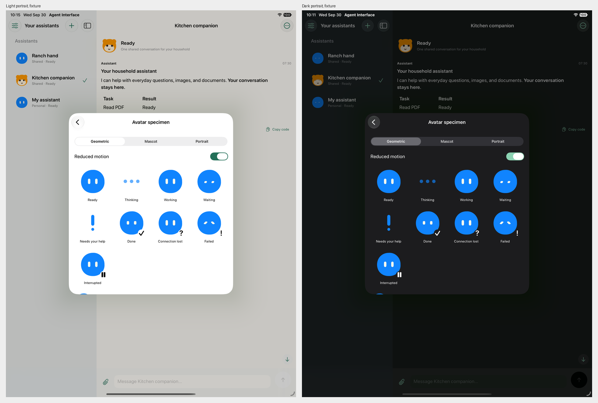
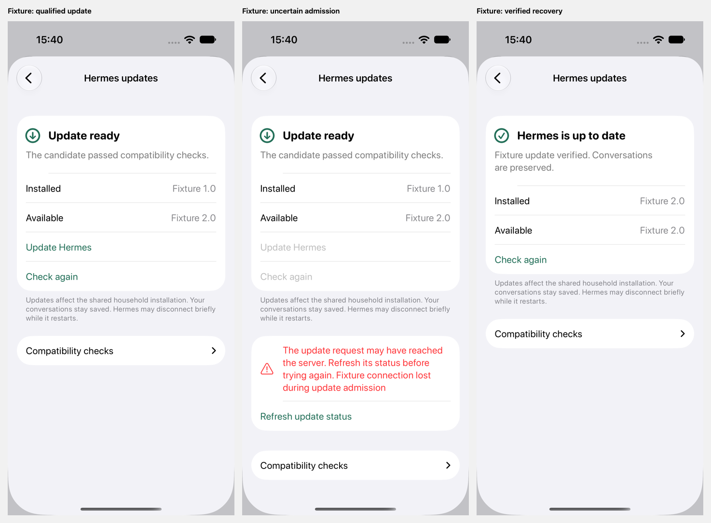

# Native parity and acceptance

The native implementation uses the web client's settled scope in
[`docs/Plan.md`](../docs/Plan.md) and the same server endpoints. "Implemented"
means the native control and authenticated request path exist. The validation
ledger remains the repository's single source for tested code-state hashes.

The native unit run passed 43 tests on Xcode 27 and iOS 27. The subsequent Today
frontier update passed eight focused unit tests and two phone UI flows. October 1 focused
simulator UI checks covered account health, the real Calendar permission prompt
and denial, confirmed service recovery, and disconnect followed by a refreshed
account state using Hermes's actual response shape. Reminder selection excludes
the day after the selected Through date. Focused phone fixture
UI checks covered upgrade qualification, uncertain install recovery, verification,
and live activity with exposed reasoning and tool arguments. Previous tablet fixture
UI checks passed in light and dark appearance. The root agent also validated
system-browser sign-in, Keychain storage, canonical chat, the full tool catalog,
and avatar settings against the isolated real Hermes instance.

These screenshots show static reduced-motion states. They do not establish live
motion fidelity or notification delivery.

These upgrade screenshots establish native controls and recovery behavior with
fixture responses. They do not establish a real Hermes upgrade. The
[native activity fixture](evidence/native-live-activity-fixture.png) shows visible
working avatars and Advanced disclosures using explicitly exposed fixture data.

| Feature | Native implementation | Validation |
| --- | --- | --- |
| Today overview | Recent canonical events and date-filtered replies, pending decisions, live status and files, per-assistant read failure, canonical conversation links, explicit account-level Mark caught up acknowledges the exact returned ingestion frontier, with page-by-page catch-up for queued results | Native recency tests reject old and undated summaries; phone and iPad fixture UI exercised recent event/reply and conversation navigation; affected native unit and phone UI checks verified exact snapshot acknowledgment, queued pages, and late imported events dated before the prior recap marker |
| Hermes memory | Exact Hermes profile scope and ownership labels, entry editing and forgetting with explicit document save, revision conflicts preserved across unsaved documents | Native cross-document CAS regression; phone and iPad fixture read, forget and save flow; production writes require the qualified Hermes add-on |
| Passwords and logins | Native Hermes profile vault metadata, masked add form, confirmed local removal, installed external source controls; inline login, code, unlock and named-secret requests bound to the current native owner; ephemeral fields clear on submit/background/dismissal, uncertain requests become read-only with explicit refresh | Ten focused unit checks; phone and iPad fixture management, secure request and background clearing flows; final uncertainty checks on both devices assert disabled fields and no replay. Real native storage and browser guards are recorded separately in the main ledger |
| Voice messages and replies | Explicit microphone permission, two-minute AAC recording, authenticated 8 MB transcription bound, editable transcript before adding to draft, draft remains unsent, recording stops on dismissal/background; Read aloud and Stop use the device's iOS voice and omit interactive JSON | Native multipart/authentication/bound tests; phone and iPad voice review sheet, phone simulated iOS speech start/Stop controls; real microphone audio and provider transcription remain external acceptance |
| Interactive reply cards | Opt-in editable assistant instructions; strict agent-ui v1 cards; per-account saved checklist choices and itinerary notes; rejected blocks remain readable code; calendar proposals open Apple's event editor for review and explicit Save | Native invalid URL/date/schema/duplicate-ID parsing tests; phone and iPad saved checklist UI; physical calendar Save remains external acceptance |
| Connection onboarding | Pasted/bare HTTPS address, origin normalization, compatibility check, retry, change server | Simulator address validation; native origin/PKCE contract tests |
| Household sign-in | System browser handoff, S256 PKCE and callback state validation, Keychain bearer, proactive expiry, revoking sign-out | Real ad hoc signed simulator system-browser/local-member handoff and Keychain storage; native token/header/expiry/revocation tests |
| Personal and shared bots | Persistent roster, attribution, per-user personalization, create/edit/delete | Native forms and roster-to-conversation simulator path; server configuration integration in main ledger |
| Conversation and activity | Canonical transcript polling, Markdown/code/tables, read-only task lists, inline live animated avatar, Advanced exposed reasoning and actual tool arguments/status/results, deduplicated current calls, nine activity states | Native real-Hermes chat simulator path; Markdown/date/geometry and current-tool deduplication tests; focused live activity/details fixture UI pass |
| Steering and stop | Active-work guidance default, explicit stop confirmation | Same tested server admission/steering/stop routes; native controls implemented |
| Approvals and clarification | Household approve/deny, stale-server errors, answer options and text, official-interface fallback | Native controls implemented; server enforcement and clarification integration in main ledger |
| Interrupted/uncertain work | Per-run review, durable request IDs, lookup, reviewed same-ID retry, definitive-rejection recovery | Native unit tests for rejection vs uncertainty, new interruptions, identity changes and accepted-draft clearing |
| Offline recovery | Loaded roster/transcript cache in memory, scoped local drafts/read positions, backoff, manual reconnect, no automatic message replay | Native disconnect, canonical-read outage, read-anchor and identity-race tests |
| Uploads and delivery | Images, PDFs and text, ten attachments, 20 MB bound, authenticated image/Quick Look preview and share | Native multipart transport and identity-race tests; server upload/download integration in main ledger |
| Model/provider/instructions/MCP | Shared-model confirmation, existing model choices/identifiers, instructions, existing MCP identifiers | Native forms implemented; server configuration integration in main ledger |
| Tools and skills | Catalog reads, required-skill locking, explicit save, save disabled until successful catalog read, retry | Native catalog-failure simulator test; real-Hermes native tool-catalog read; server catalog integration in main ledger |
| Routines | Create/edit/delete/pause/resume, server-provided recipes starting paused, Hermes timezone and next-run preview, successful matching preview required before saving an enabled routine, explicit recipients; confirmed Try once with a durable request ID, uncertain receipt check and reviewed same-ID retry, completed runs allow a new trial | Native receipt decode; phone and iPad preset/timezone UI; phone and iPad uncertainty recovery verified a fresh request ID for a completed second trial; server execution integration in main ledger |
| Three avatar modes | All nine original geometric silhouettes, palette/custom color, eyes/spacing/size, accessories, sprout/fox/bear mascot with ears, muzzle and glossy eyes, generated/uploaded portrait with a per-state ring | Native shape geometry tests; specimen state matrix of eight characters across all nine states |
| Avatar editor | Live preview with state chips, segmented style that keeps color, eyes, accessory and eye tuning across styles, mini-avatar tiles for shape, character, eyes and accessory, swatches and custom color, eye sliders with percentages and Reset eyes | Simulator screenshot tour |
| Avatar motion | Ported from `src/components/avatar-motion.ts` with the same constants: 280 ms shape morph, expression smoothing (0.09 s) and symbol morph (0.13 s), arrival boop, blink and gaze wander, sphere-projected face that hides far-side features, working scan and spin with trails that wrap behind and in front of the body, trail carry-over between states, two-turn done celebration that settles into happy eyes, failed shake, thinking dots, blocked exclamation. Connection lost and interrupted never move. Badges only for done, failed, connection lost and interrupted; portraits badge every state except ready, thinking and working | Native motion tests mirror `tests/avatar-motion.test.ts`; native specimen inspection remains recorded separately from web reference acceptance |
| Reduced motion and accessibility | System reduced motion halts loops/rotation/trails, the assistant list states each non-idle activity in words, stable state language, native Dynamic Type and controls, labelled actions | Native specimen toggle; physical VoiceOver and large Dynamic Type acceptance remains external |
| Preferences | Simple/advanced presentation, system/light/dark themes, favorites, sections, default bot, follow all activity | Native preferences forms and tablet visual inspection; same persisted per-user server contract |
| Shared computer | Preferences opens the configured app server's `/?computer=1` in the system browser for the shared desktop and VPS terminal; browser sign-in stays separate from the native token | Native link uses the existing same-origin URL builder; rendered interaction validation recorded in the main ledger |
| Hermes updates | Preferences entry, installed/candidate versions, check and compatibility details, confirmed pinned-revision install, progress polling, guarded restart/retry/cancel recovery from server action availability, safe-boundary guidance, uncertain recovery without replay, rollback/failure guidance, busy-bot/admin/unavailable guidance; shared server bearer authorization | Native contract tests for authenticated requests, stale candidates, stale recovery operation IDs, uncertain install/control recovery and identity fences; focused phone fixture UI covered guarded restart recovery in addition to qualification, uncertain admission, progress and verification |
| Integration accounts | Preferences and per-assistant Connections view; checked/configured/expired/permission/outage states, safe account identity and access details, Connect/Reconnect/Disconnect, setup fields, custom MCP and browser sign-in with durable flow polling | Native build and explicit simulator fixture account check and disconnect; real provider sign-in remains external acceptance |
| Apple Calendar and Reminders | EventKit full-access permission requested explicitly, selected calendars/lists and bounded date window, sanitized preview, refresh, explicit upload into the chosen assistant draft; user sends it from the conversation | Native upload/draft-preservation contract test and simulator permission status/selection view; physical-device permission and real account data sharing remain external acceptance |
| Native notifications | APNs device registration/opt-out/test, task/routine/follow recipients, validated cold/warm conversation tap | Native route tests and simulated server delivery tests; signed physical-phone delivery remains external |
| iPad | Adaptive native NavigationSplitView, readable-width transcript, native sheets | Tablet fixture UI navigation, settings and nine-state specimen exercised; portrait/landscape screenshots inspected in both themes |

The household feature screenshots use explicit Debug-only transport fixtures. The
[phone review](evidence/native-household-phone-review.png) and
[iPad review](evidence/native-household-ipad-review.png) show Today, memory,
checklists, routine previews and voice review. The iPad review also shows confirmed
trial recovery. The [Today frontier review](evidence/native-today-frontier-review.png)
shows page acknowledgment and a late imported result that predates the prior recap
marker. They validate native controls, not real Hermes execution or audio
provider output. The earlier [native activity screenshot](evidence/native-live-activity-fixture.png)
records the conversation before these additions.

The [passwords and logins phone review](evidence/native-vault-phone-review.png),
[iPad inline request review](evidence/native-vault-ipad-inline-review.png) and
[iPad management review](evidence/native-vault-ipad-detail-review.png) use synthetic
Debug-only fixtures. They show masked entry, native profile ownership, source
controls and cleared, read-only recovery after an uncertain answer. They do not
establish an actual external password-manager unlock or physical-device behavior.
The [cancelled login-save review](evidence/native-vault-add-cancel-phone-review.png)
shows a fixture that saves before losing its response: the form clears and blocks
another Save, then dismissal refreshes metadata to reveal the stored login.

## External acceptance

These checks require an installed signed build or configured external services:

- On a physical iPhone, grant and deny microphone access, record and transcribe with the configured real provider, correct the transcript, add it to an existing draft, and send explicitly. Verify device Read aloud and Stop using audible output.
- On a physical iPhone, review an assistant calendar proposal in Apple's event editor and confirm cancellation saves nothing and explicit Save creates the reviewed event in the chosen calendar.
- Complete real integration OAuth/device-code sign-in and cancellation for each configured provider, including returning to the same native account view.
- On a physical iPhone, grant and deny EventKit access, choose calendars/reminder lists, inspect a selected snapshot, send its uploaded attachment, and verify Hermes reads the selected data. Data is a manually refreshed snapshot. Hermes has no unattended access to the phone while this app is closed.
- Complete real Google household sign-in on the configured production origin.
- Install the app on a physical iPhone, register its APNs token, close the app,
  receive a real completion and approval notification, and confirm each opens
  the correct saved conversation. Test native notification opt-out after relaunch.
- Inspect the native avatar specimen in motion at sidebar and expanded sizes,
  comparing all nine states with the original web specimen and reference
  inventory. Quantitative pixel equality with proprietary upstream animations is
  not claimed.
- Verify VoiceOver, large Dynamic Type, and the simulator-reviewed layouts on a physical iPad.
- Verify provider-generated images and generated portraits using a configured
  real image provider. Deterministic fixture images do not prove provider output.

XCTest fixture UI results, server transport tests, real Hermes probes, and
physical APNs delivery are different evidence classes. None substitutes for the
others.
